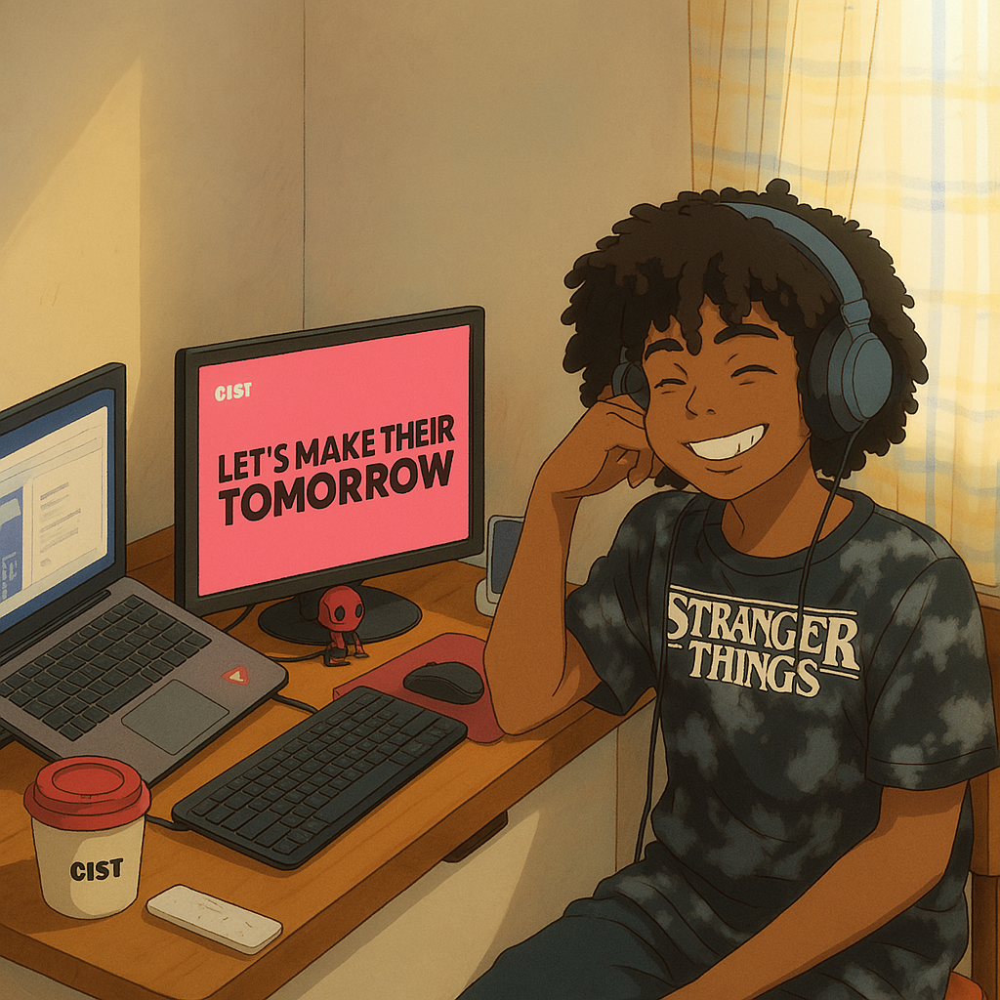

# Hello! I'm Caique Brener!
* 🔭 I am currently working as an Android developer.
* 🤝 I'm interested in collaborating on open-source projects.
* 🌱 I have skills with hybrid developement.
 
  

       
       
         

  
  
## Learning
  
  
  
 
  
  
  
    
    
          

## Hard Skills

 
  
  
  
    
  
  
  
  
  
  

## Contact Me

  
   
   

  

 